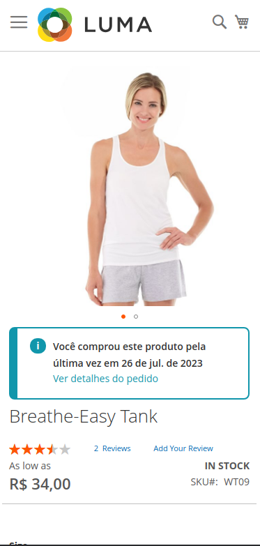

# Magento 2 Module: Product Last Order

The "Product Last Order" module is an extension for Magento 2 developed by Discorgento that generates a personalized message to the customer when they access a product that has been previously purchased. The message informs the customer that they have already bought this item and also displays the date of the purchase. Additionally, the module adds a "Order Details" link that, when clicked, redirects the customer to the corresponding Order Details page, providing all the details of the accessed order.

## Features

- Generates a personalized message for products previously purchased by the customer.
- Displays the date of the product purchase.
- Adds an "Order Details" link to redirect the customer to the Order Details page.

## System Requirements

Make sure your Magento 2 installation meets the following requirements:

- Magento 2.x
- PHP 8.x
- Composer

## Installation

You can install the "Product Last Order" module via Composer. To do this, execute the following commands in the terminal:

1. Navigate to the root of your Magento 2 project:

```bash
cd /path/to/your/magento2/project
```

2. Use Composer to install the module:

```bash
composer require discorgento/module-product-last-order
```

3. Enable the module:

```bash
php bin/magento module:enable Discorgento_ProductLastOrder
```

4. Run the Magento setup upgrade to enable the module and refresh the cache:

```bash
php bin/magento setup:upgrade
php bin/magento cache:clean
```

## Usage

After the installation, the module will automatically generate the personalized message on products that have been previously purchased by the customer. The message will be displayed on the product detail page.

By clicking on the "Order Details" link in the message, the customer will be redirected to the corresponding Order Details page, where they can access all the information about the order.




## Support and Contributions

If you encounter any issues with the module or want to contribute improvements, feel free to open an [issue](https://github.com/discorgento/module-product-last-order/issue) or submit a [pull request](https://github.com/discorgento/module-product-last-order/pulls) on the [module's repository](https://github.com/discorgento/module-product-last-order).

## License

This module is distributed under the [GNU General Public License v3.0](https://github.com/discorgento/module-product-last-order/blob/feat/readme/LICENSE.txt). Please read the "LICENSE" file for more information.

## Author

"Product Last Order" was developed by [Discorgento](https://www.discorgento.com).

🐓

## Notes 🗒
 - issues and PRs are welcome in this repo;
 - we want **YOU** for [our community](https://discord.io/Discorgento)!
